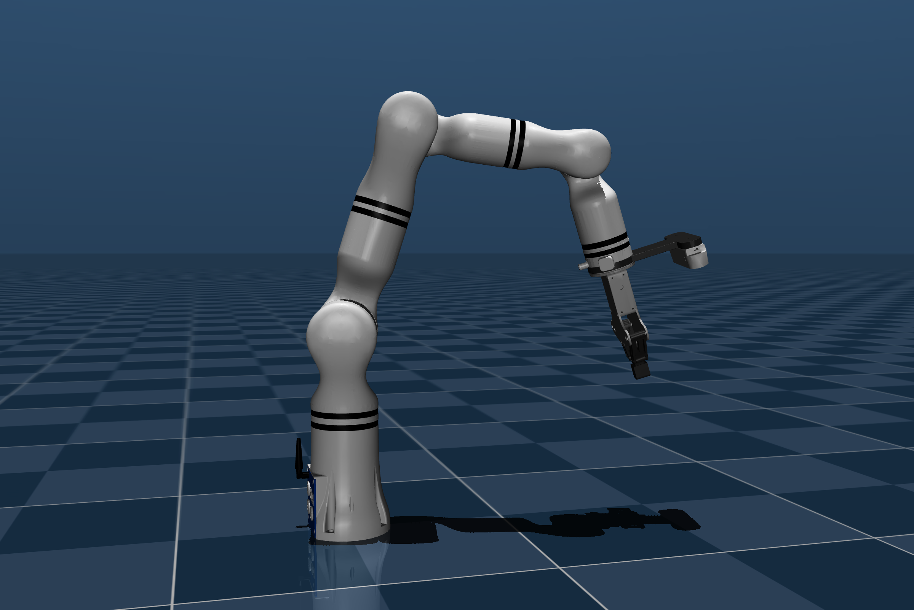

```bash
cd urdf2mjcf/examples/realman-rm65

urdf2mjcf rm65b_eg24c2_description.urdf -o mjcf/rm65.xml -m metadata/metadata.json -am metadata/actuator.json -dm metadata/default.json -a metadata/appendix.xml --no-convex-decompose

python -m mujoco.viewer --mjcf=mjcf/rm65.xml
```
